# <Goalsy>

## Description

Goalsy is a  fun and engaging task list app, perfect for keeping you on track in your day to day life. Stay motivated to get stuff done and get rewarded for completing tasks. Spend your rewards in the shop, where you can buy cool new items for your character! We was highly motivated to contribute to this project be we wanted to make a full stack application that will help a user in their everyday life. This application helps users to preform daily task by making it fun and exciting to help user reach GOALS!

## Table of Contents

- [Installation](#installation)
- [Wire-Frame](#wire-frame)
- [Acceptance-Criteria](#acceptance-criteria)
- [Usage](#usage)
- [Credits](#credits)
- [License](#license)
- [Webpage](#webpage)

## Installation

What are the steps required to install your project? Provide a step-by-step description of how to get the development environment running.

## Wire-frame 

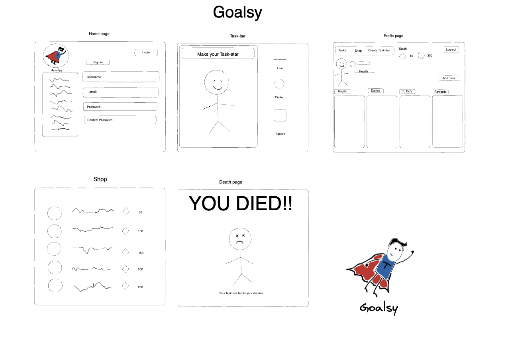

## Acceptance-criteria

## Usage

Upon going to the Taskify website, sign up to create an account or login.

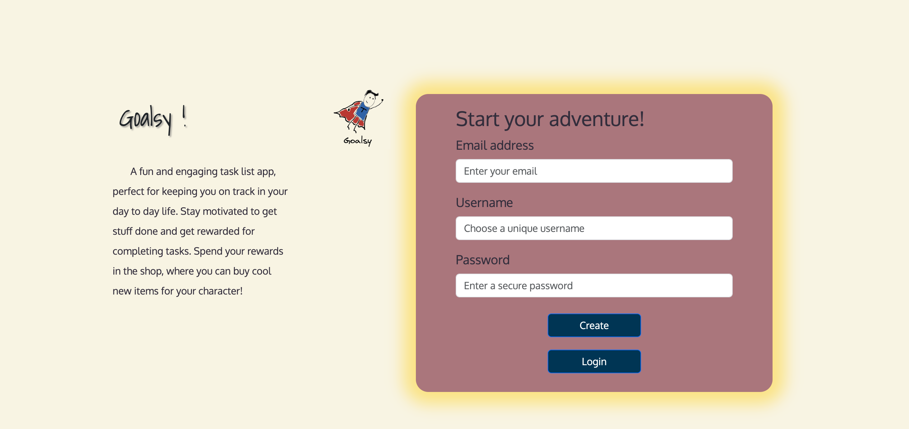

 After logging into your account you can add a task by clicking onto the task category drop down. After clicking the drop down you'll see these categories: Health and Wellness, Cleaning, School, Workout, and Creative. 
 
 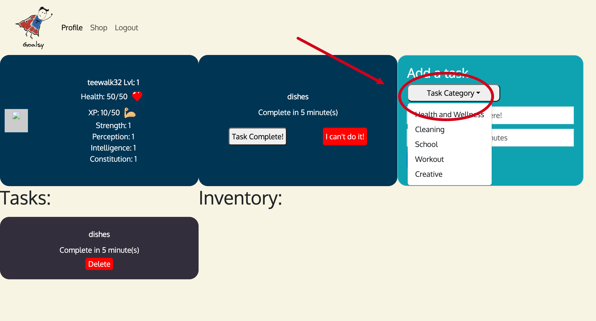

 Once you have selected a category you'll be able to enter your task name and the time to complete in minutes.
 
 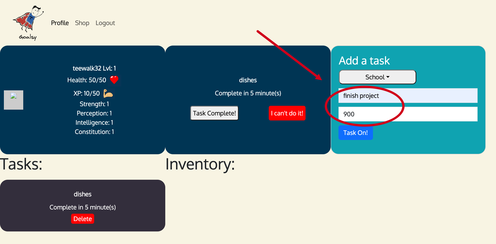
 
  After you have made your entries you click the 'Task On!' button. You will be prompted with a note that says 'Task added successfully'.
  
 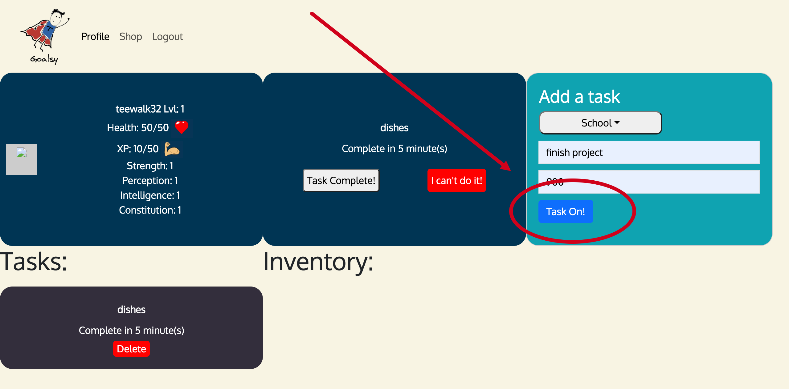
  
   After acknowledging the prompt the task will have a section under 'Task'.
   
 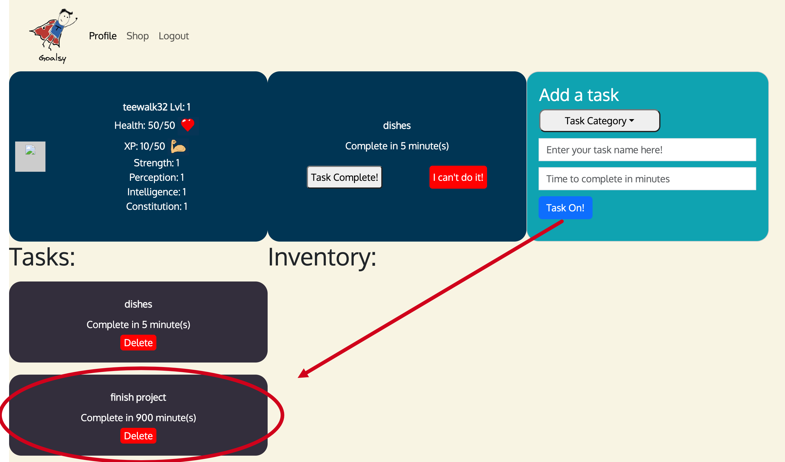
   
 If the task was added my mistake you can click the delete button in the task section.
    
 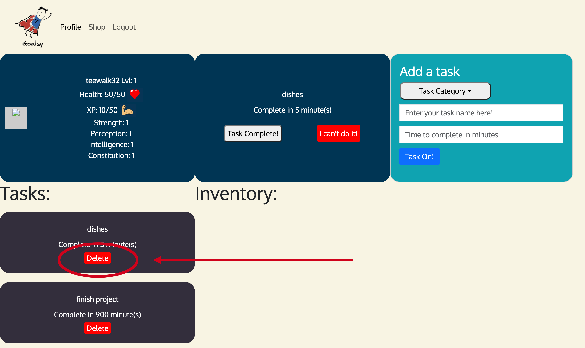
    
  Click task complete when you complete your task.

 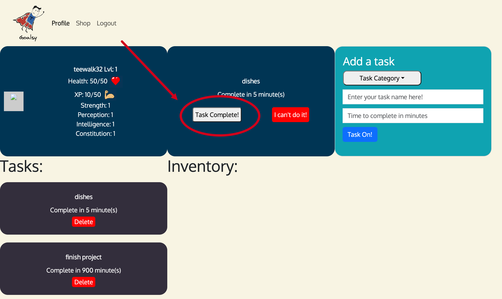
     
  If you can't do the task or give up you can click 'I can't do it!' and that task will be deleted.
    
   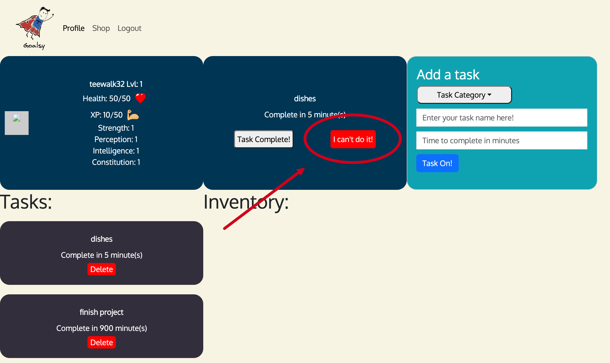
    
   In the navagation bar beside Super Goalsy there is a 'shop' button that you can click that brings you to a page where you can buy Weapons, Armor, and Jewelry.
     
   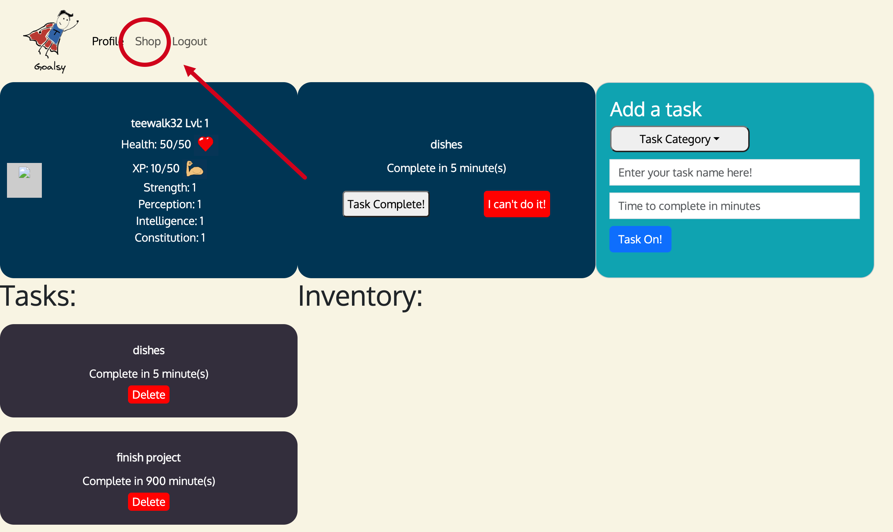
     
   These items can be purchased with the coins you earned from completing task.
      
   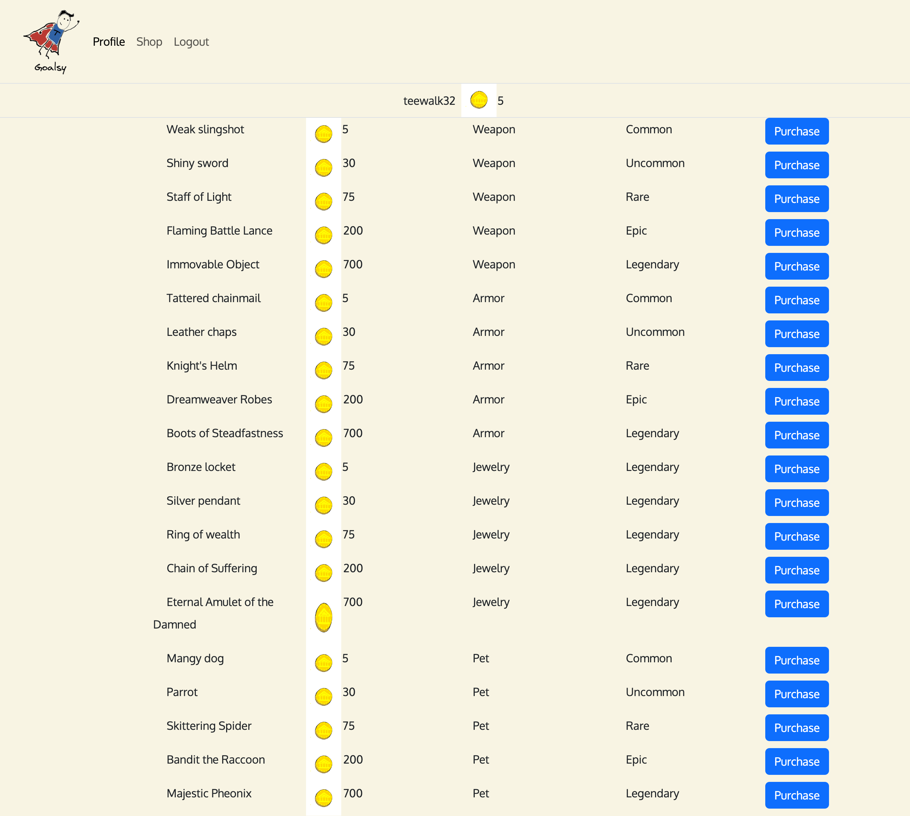

   Once you're done making purchases you can navigate back to your profile by clicking onto the profile button in the navigation bar so you can continue completing task!

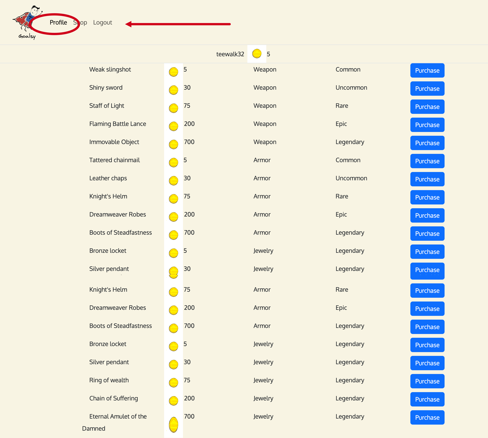

## Credits

Micheal Reagan - https://github.com/MCReagan

Tevin Walker - https://github.com/teewalk32

Ellen Kobly - https://github.com/notalisk

Frankcisco Orona - https://github.com/Oronafrankie87

   ~Tutorials and documents followed for this project linked below.~

https://getbootstrap.com/

https://lucid.app/documents#/documents?folder_id=recent

https://www.npmjs.com/package/html-to-image

## License

MIT License is included in this project. Please refer to the repository for more information.

## Webpage

