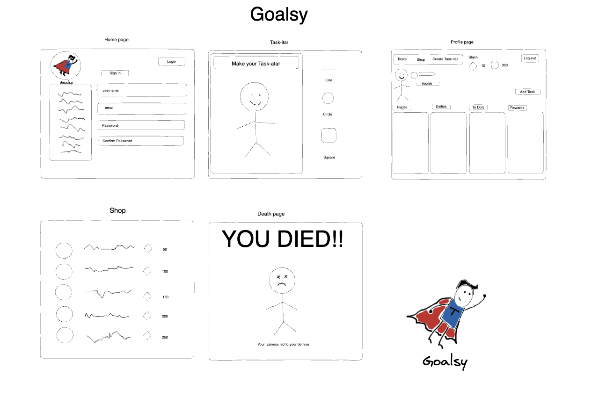

# <Goalsy>

## Description

A fun task list website that gamifies your everyday to-do list. Earn points that you can spend in the shop for cool cosmetics and earn experience to level up your character!

## Table of Contents

- [Installation](#installation)
- [Wire-Frame](#wire-frame)
- [Acceptance-Criteria](#acceptance-criteria)
- [Usage](#usage)
- [Credits](#credits)
- [License](#license)
- [Webpage](#webpage)

## Installation

What are the steps required to install your project? Provide a step-by-step description of how to get the development environment running.

## Wire-frame 

## Acceptance-criteria

## Usage

Provide instructions and examples for use. Include screenshots as needed.

To add a screenshot, create an `assets/images` folder in your repository and upload your screenshot to it. Then, using the relative file path, add it to your README using the following syntax:

## Credits

Micheal Reagan - https://github.com/MCReagan

Tevin Walker - https://github.com/teewalk32

Ellen Kobly - https://github.com/notalisk

Frankcisco Orona - https://github.com/Oronafrankie87

~Tutorials and documents used for this project linked below.~

https://getbootstrap.com/

https://lucid.app/documents#/documents?folder_id=recent

## License

MIT License is included in this project. Please refer to the repository for more information.

## Webpage
